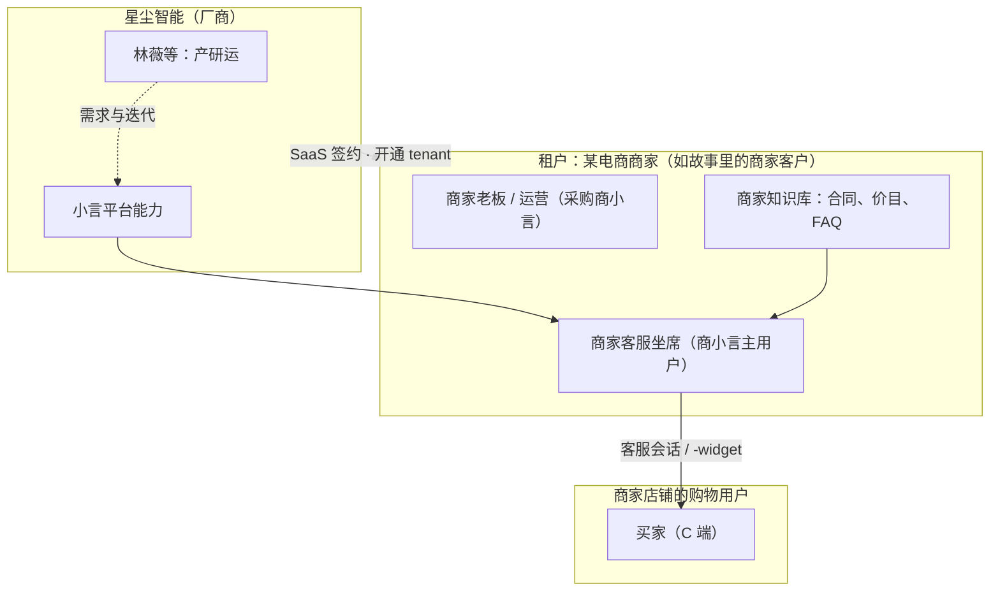
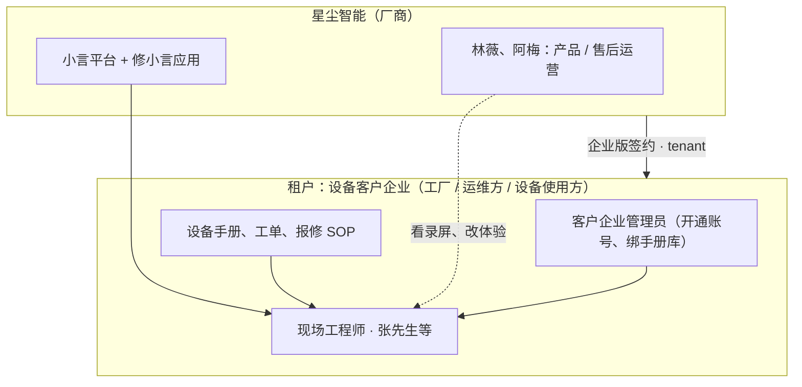
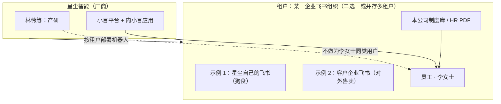
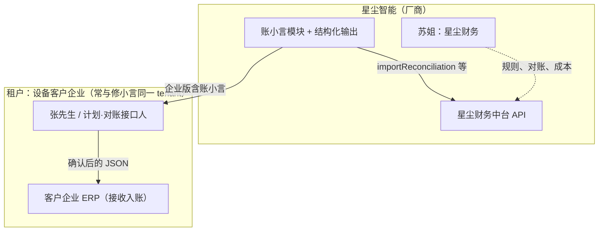

# 系列世界观与阅读指南

> **给转行 AI 的 B 端互联网 PM**：本系列用连续人物（林薇、阿梅、苏姐等）讲 **AI 产品机制**。故事里口语里的 **「小言」** 有两层含义——读任何一篇前，先花 2 分钟看清下面这张「平台 vs 应用」地图，就不会把 **电商客服、设备售后、飞书助手、对账入账** 误当成同一个聊天窗口。

---

## 1. 公司是谁？产品在卖什么？

- **公司（虚构）**：**星尘智能**——做 **B 端 AI 应用平台** 的创业公司（林薇从传统 SaaS 转岗而来，见第 1 篇）。
- **对外叙事**：帮客户 **降本增效**（客服分流、售后提效、企业内部问答）。
- **技术叙事（不必记名词）**：底层是 **小言平台**（模型、检索、路由、护栏、工具、评测）；上面挂多个 **独立产品入口**，权限与数据域分开——**现实中不会一个微信号包办天下**，系列用同一个昵称 **「小言」** 指 **平台能力 + 各应用里的对话界面**，方便讲故事。

---

## 2. 小言平台 vs 四个应用（A/B/C/D）

| 代号 | 产品名（故事内） | 谁在用 | 典型任务 | 和 B 端互联网的对应 |
|------|------------------|--------|----------|---------------------|
| **应用 A** | **商小言** | 电商 **商家** 的客服/运营（间接服务 **买家**） | 合同条款、价目、退货、FAQ | 你们熟悉的 **智能客服 SaaS、工单助手、对接商家 ERP** |
| **应用 B** | **修小言** | **设备客户企业** 的工程师、采购、现场人员（如张先生） | 拍照报修、查手册、滤芯/停产类 **售后与运维** | **B2B 硬件/工业品售后**、现场 App、微信客服 |
| **应用 C** | **内小言** | **企业正式员工**（飞书/钉钉内） | 年假制度、内部政策、协作问答 | **企业 Copilot、知识库问答、HR/法务助手** |
| **应用 D** | **账小言** | 客户企业的 **财务/计划** 接口人 + 星尘侧 **财务中台对接** | 对账汇总、**结构化入账**、调用 `importReconciliation` 等 API | **业财一体化、结算对账、Open API 集成**（与「聊天」弱相关、与 **字段契约** 强相关） |

**平台层（不叫 A/B/C，但每篇都可能涉及）**

- **阿寻**：检索/RAG 库房（公共手册、合同、制度库）。
- **老何**：模型路由（故事里的「一至四楼」= 成本/能力分档，**跨应用共用**）。
- **老关**：安全护栏（输入/输出/工具动作）。
- **统一网关**：流式、Token 计费、评测——在 **商小言 + 修小言 + 内小言** 上复用。

```text
                    ┌─────────────────────────────────────┐
                    │           小言平台（能力层）           │
                    │  路由 · RAG · 护栏 · 工具 · 评测 · 计费  │
                    └─────────────────────────────────────┘
              ┌──────────┬──────────┬──────────┬──────────┐
              ▼          ▼          ▼          ▼          │
         应用 A        应用 B        应用 C        应用 D      │
        商小言        修小言        内小言        账小言      │
      商家客服      设备售后      飞书员工      对账/入账 API  │
```

---

## 3. 星尘四条产品线 + 各篇时间线

**怎么读时间线**：系列 **不是**「星尘先只做内小言、开头几篇是内部部署」——**开头是在做商小言（应用 A）**；修小言 / 内小言 / 账小言 是 **同一平台成熟后陆续上线或重点讲故事的产品线**。下表是 **推荐阅读顺序下的「产品主线」**，与日历日期一致。

| 阶段 | 大致篇序 | 产品线 / 平台 | 故事里在发生什么（产品视角） |
|------|----------|----------------|------------------------------|
| **立项与商小言 MVP** | 第 1 篇 | → **商小言 A** | 定义智能客服方向；小言先作为 **LLM 人格比喻** |
| **商小言能力补齐** | 第 2–5、7、11 篇 | **商小言 A** | Prompt、RAG、Agent、Tool、幻觉、Grounding——**商家合同/退货/FAQ** |
| **平台化（全应用共用）** | 第 6、8–10、12–15 篇 | **小言平台** | Token、Embedding、上下文、Rerank、微调、LoRA、评测、推理成本——**不绑定单一应用** |
| **第二条产品线：修小言** | 第 16 篇起 | **修小言 B** | 设备售后助手 2.0、拍照报修；与 **商小言并行售卖** |
| **平台运营与安全** | 第 17–19 篇 | **平台网关 + A/B 会话** | 护栏、模型路由（一至四楼）、流式体验 |
| **账小言 + 内小言深化** | 第 20–22 篇 | **账小言 D**、**内小言 C** | 结构化入账；飞书记忆与混合检索（**内小言租户见下节示意图**） |

```text
时间线（产品叙事，非真实日历严格隔离）

  6月                    7月上              7月中              7月下
   │                      │                  │                  │
   ├─ 商小言 A ───────────┼──────────────────┼── 仍在线 ────────┤
   │  (篇 1-5,7,11…)       │                  │                  │
   │                      ├─ 平台能力层 ──────┼──────────────────┤
   │                      │  (篇 6,8-15…)    │                  │
   │                      ├─ 修小言 B ────────┼── 篇 16+ ────────┤
   │                      │                  ├─ 平台路由/流式 ──┤
   │                      │                  │  (篇 17-19)      │
   │                      │                  ├─ 账小言 D ───────┤ 篇 20
   │                      │                  └─ 内小言 C ───────┘ 篇 21-22
```

**星尘自己用不用内小言？**  
可以。**狗食（自研自用）** 时：星尘是 **内小言的租户**，林薇、苏姐等是 **星尘飞书里的员工**——但 **故事第 1–19 篇主线仍是「做商小言/平台」**，**不是**「全员在用内小言」。**李女士（第 21–22 篇）** 代表 **内小言终端用户**；为讲清记忆与检索，**未写死** 她是星尘还是某客户企业员工——**默认：某一租户下的普通员工**（见 **内小言示意图**）。

**厂商侧角色（一般不当作「小言终端用户」）**：林薇（PM）、大刘/小陈（研发/算法）、阿梅（售后运营）、苏姐（星尘财务）、老周（顾问）——他们 **做或运营** 产品，不是商小言里「问退货的商家客服」。

---

## 4. 各产品：用户与租户关系示意图

下面四张图统一约定：

- **租户（Tenant）**：签约、隔离数据与知识库边界的那家 **组织**（有 `tenant_id`）。
- **终端用户（End User）**：在该租户账号下 **实际点进对话** 的人。
- **星尘**：软件厂商，**不是** 商小言/修小言租户里的「商家」或「工厂」，除非特别说明 **星尘自用作内小言租户**。

### 4.1 商小言：用户与租户关系

**一句话**：星尘把 **商小言** 卖给 **电商商家（租户）**；商家客服/运营 **用小言** 查合同、办退货；**买家的购物咨询** 往往通过 **商家店铺里的客服窗口** 触达（买家 **不是** 星尘 SaaS 的登录用户）。



| 角色 | 是否租户 | 是否商小言登录用户 | 典型故事篇 |
|------|----------|-------------------|------------|
| 星尘产研 | 否 | 否（用后台/飞书） | 全系列 |
| 电商商家组织 | **是** | 老板/管理员配置 | 3–5、7、11 |
| 商家客服 | 属租户内 | **是** | 3–5 |
| 淘宝/拼多多买家 | 否 | 否（只聊天） | 4 |

---

### 4.2 修小言：用户与租户关系

**一句话**：星尘把 **修小言** 卖给 **买了工业/硬件设备并要做售后的企业（租户）**；该企业里的 **工程师、采购、现场人员** 用 App/微信 **查手册、报修、问停产**。**张先生** 属此类用户（**不是星尘员工**）。



| 角色 | 是否租户 | 是否修小言用户 | 典型故事篇 |
|------|----------|----------------|------------|
| 设备客户企业 | **是** | 管理员配置 | 16、18–19 |
| 张先生（工程师） | 属租户内 | **是** | 16、19–21（对账口径） |
| 星尘阿梅 | 否 | 否（运营修小言产品） | 16–19 |

---

### 4.3 内小言：用户与租户关系

**一句话**：星尘把 **内小言** 部署在 **某一企业的飞书/钉钉**（**租户**）。该企业的 **正式员工** 在 IM 里问 **本公司** 制度、年假、内部 Wiki。**租户可以是外部客户，也可以是星尘自己（狗食）**——两种都成立，故事不强制二选一。



| 角色 | 是否租户 | 是否内小言用户 | 说明 |
|------|----------|----------------|------|
| 星尘公司 | 可作为 **租户 T1** | 林薇等 **可以** 问星尘年假 | 狗食场景；**第 1–19 篇未展开** |
| 某客户企业 | **租户 T2** | 该企业员工 | 对外商业化 |
| 李女士 | 属某一租户 | **是** | 第 21–22 篇；问「**我们公司**年假」 |
| 张先生 | 属 **修小言租户 B** | **不是** 内小言主用户 | 第 21 篇记忆串号 = **bug 寓言**，正常应隔离 |

---

### 4.4 账小言：用户与租户关系

**一句话**：**账小言** 多是 **修小言企业版 / 大客户的增值模块**——在 **客户企业（租户 B）** 内，由 **财务/计划接口人** 发起对账与 **结构化入账**；**星尘侧苏姐** 对接 **星尘财务中台与计费**，**不是** 客户工厂里的对账员。



| 角色 | 是否租户 | 是否账小言操作者 | 典型故事篇 |
|------|----------|------------------|------------|
| 客户企业 | **是**（常与 B 同租户） | 接口人确认入账 | 20 |
| 张先生 | 属租户内 | **是**（对账场景） | 20–21 |
| 苏姐 | 星尘内部 | 厂商侧财务治理 | 20、18（账单） |

---

## 5. 制造/业财词 → B 端互联网 PM 翻译（读 18–22 篇用）

故事从第 17 篇起增加 **工业设备售后**，第 18 篇起频繁出现 **工厂对账** 皮肤——**概念通用，行业可替换**。

| 故事用语 | 一句话解释 | 你可换成 |
|----------|------------|----------|
| **产线 A 线 / B 线** | 工厂里两条生产线；数据按线分开统计 | 两个 **业务线 / 大区 / 租户分区** |
| **MES** | 制造执行系统：记 **产量、工单、批次** 的「业务事实库」 | 订单/履约 **业务库**、CRM 出货量 |
| **PLC** | 产线控制侧采集的数据源，常和 MES **各记各的** | 另一套 **埋点/日志/渠道回传** |
| **对账** | 两套数据比数量/金额，找差异 | 支付渠道账 vs 内部订单、广告消耗 vs 客户后台 |
| **四楼** | 路由隐喻：**最贵、最慢、最复杂** 的模型档（停产、合规、长 SOP） | 旗舰模型 / 人工升级档 |
| **张先生** | **应用 B/D 的客户企业用户**（不是星尘员工） | 大客户的运营/工艺/对账接口人 |
| **苏姐** | **星尘内部财务** | 你们公司财务/成本负责人 |
| **李女士** | **应用 C** 的典型用户（问年假等制度） | **某一内小言租户** 下的员工（星尘狗食或客户企业均可） |

---

## 6. 各篇对应哪个应用？（索引）

| 序号 | 日期 | 故事 | 概念 | 本集主场景 |
|------|------|------|------|------------|
| 1 | 06-27 | 《读过全世界书的实习生》 | LLM | 立项期；**小言 = LLM 人格比喻** → 指向 **应用 A** |
| 2 | 06-28 | 《三封邮件，三个小言》 | Prompt | 应用 A |
| 3 | 06-29 | 《库房管理员阿寻》 | RAG | 应用 A |
| 4 | 06-30 | 《会自己跑腿的实习生》 | Agent | 应用 A |
| 5 | 07-01 | 《十七把钥匙，开一扇门》 | Tool Calling | 应用 A |
| 6 | 07-02 | 《桌上一摞纸，装不下整场会》 | Token | **小言平台**（全应用） |
| 7 | 07-03 | 《言之凿凿，查无此事》 | Hallucination | 应用 A |
| 8 | 07-04 | 《相似的地段，最抢手》 | Embedding | **平台 · 检索** |
| 9 | 07-05 | 《圆桌只坐十二人》 | Context Window | **平台** |
| 10 | 07-06 | 《海选三十，复试三甲》 | Rerank | **平台 · 检索** |
| 11 | 07-07 | 《每一句话，都要有出处》 | Grounding | 应用 A（机制全平台复用） |
| 12 | 07-08 | 《三个月口音班，值不值学费》 | Fine-tuning | **平台 · 多场景模型** |
| 13 | 07-09 | 《抽屉里的口音片》 | LoRA / PEFT | **平台 · 多租户** |
| 14 | 07-10 | 《三把尺子量小言》 | Evaluation | **平台 · 全应用** |
| 15 | 07-13 | 《每说一句话，都要付运费》 | Inference Cost | **平台 · 全应用** |
| 16 | 07-14 | 《用户发来一张图》 | Multimodal | **应用 B** |
| 17 | 07-17 | 《门卫老关的三本册子》 | Safety / Guardrails | **平台网关**（A+B 为主） |
| 18 | 07-18 | 《分诊台的老何》 | Model Routing | **平台 · 统一接入**（一至四楼） |
| 19 | 07-19 | 《先看见第一句》 | Streaming | **平台**（A+B 会话为主） |
| 20 | 07-20 | 《半张表进不了财务系统》 | Structured Output | **应用 D**（修小言企业版/对账模块） |
| 21 | 07-21 | 《昨天的口径今天又问一遍》 | Memory | **应用 C** + 应用 B 用户张先生 |
| 22 | 07-22 | 《两条队，一个柜台》 | Hybrid Retrieval | **应用 C** + 公共制度库 |
| 23 | 07-23 | 《开播前的那份剧本》 | System Prompt | **小言平台**（内小言 vs 商小言配置） |

---

## 7. 后续新篇写作规则（系列改版后）

1. **文首表格**必须含：`本集应用`、`世界观` 链接（本文档）。
2. **首次出现行业专有词**（制造、医疗、金融等），在「知识树」段落后增加 **场景白板**（3–6 行）：本集用户是谁、发生在哪个应用、生僻词白话。
3. **不要把应用 A/B/C/D 写成同一个租户**；跨应用只通过 **平台能力、客户企业名称（如张先生所在工厂）** 串联。
4. 教的是 **机制**（RAG、结构化输出、记忆…），行业皮肤可换；换皮肤时 **场景白板必更新**。

---

## 8. 常见误读澄清

| 误读 | 正读 |
|------|------|
| 「小言既对外客服又对内飞书」是一个产品 | 是 **同一平台下的多个应用**；故事偷懒共用一个名字 |
| 「林薇公司在工厂里开产线」 | 星尘是 **软件公司**；产线是 **客户企业** 的场景（应用 B/D） |
| 「MES/PLC 是 PM 必懂」 | 只是 **双数据源对账** 的寓言皮肤；做互联网可对齐 **双系统对账** |
| 「四楼 = 第四个产品」 | **路由分档隐喻**，不是组织架构的「四楼」 |
| 「开头几篇 = 星尘内部署内小言」 | 开头是 **商小言 A** 研发线；**内小言 C** 主线在 **第 21 篇起** |

---

*修订说明：2026-07-22 起「中度改版」新增本文档；各篇文首表格与部分篇章「场景白板」同步更新。2026-07-22 增补 **§3 产品线时间线**、**§4 四产品用户与租户示意图**（含 Mermaid）。*
